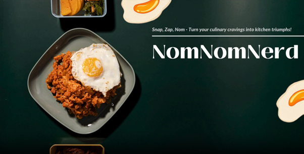

# NomNomNerd 🍽️

NomNomNerd is an AI-powered web app that takes an image of any food item and generates a detailed recipe along with its nutritional breakdown. It leverages multimodal AI to identify food and provide personalized, informative responses.

## 🔍 Features

- Upload or capture an image of a food item
- Automatically identify the dish using AI
- Get a step-by-step recipe with ingredients
- View full nutritional analysis (calories, protein, carbs, fats, etc.)
- Collect user feedback to refine suggestions

## 🧠 Models & Tools Used

- **Gemini AI** – for vision-based food recognition from images
- **LLM (GPT)** – for recipe generation and explanations
- **Truelend** – for collecting and analyzing user feedback
- **Nutrition APIs** – to provide accurate nutritional data

## 📹 Watch the Demo

## 

## 🛠️ Tech Stack

- **Framework**: Streamlit
- **AI Models**: Gemini AI (vision), Truelens (feedback)

## 📦 Installation

1. Clone the repo  
   `git clone https://github.com/Vaishnavi0805/NomNomNerd.git`

2. Install dependencies  
   `pip install -r requirements.txt`

3. Run the app  
   `python app.py`

## 📄 License

MIT License

---

*Built with ❤️ to make food discovery smarter and healthier.*
